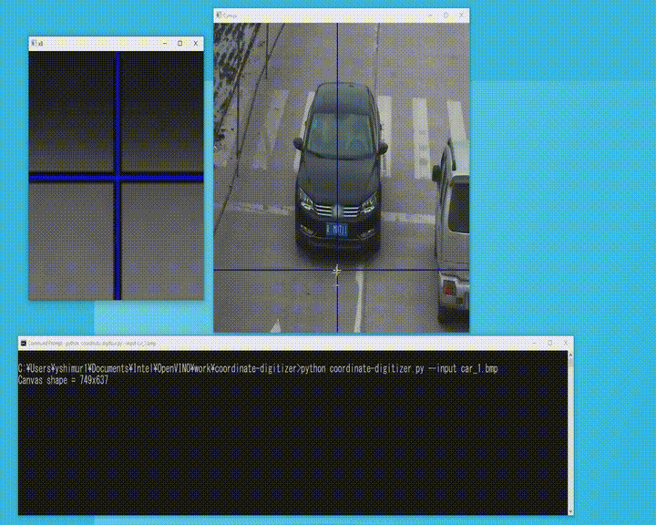

# X,Y Coordinate picker (digitizer)  

### Description:  
Small tool to pickup points in an image and display the coordinate of the points. This is very handy and useful when you want to know the coordinate of points in an image.  
The tool has magnify function. You can pick the desired points precisely.  



### How to run:  
```sh
python coordinate-digitizer.py [--input image_file | --size XXXxYYY | --cam webCam_number --video movie_file]
```

| options| description|
|----|----|
|`-i` or `--input`|Input image file name|
|`-s` or `--size`|Size of image (tool will create gray image with this size)|
|`-c` or `--cam`|ID number of webCam (camera). Starting from 0|
|`-v` or `--video`|Input video file name|  

|key|description|
|----|----|
|`ESC`|Exit program|
|`p` or `<space>`|Pause / resume movie|

### Command line examples:  
```sh
python coordinate-digitizer.py --input input.jpg
python coordinate-digitizer.py --video movie.mp4
python coordinate-digitizer.py --cam 0
python coordinate-digitizer.py --size 800x600
```
